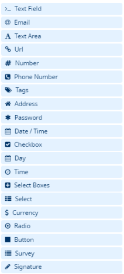
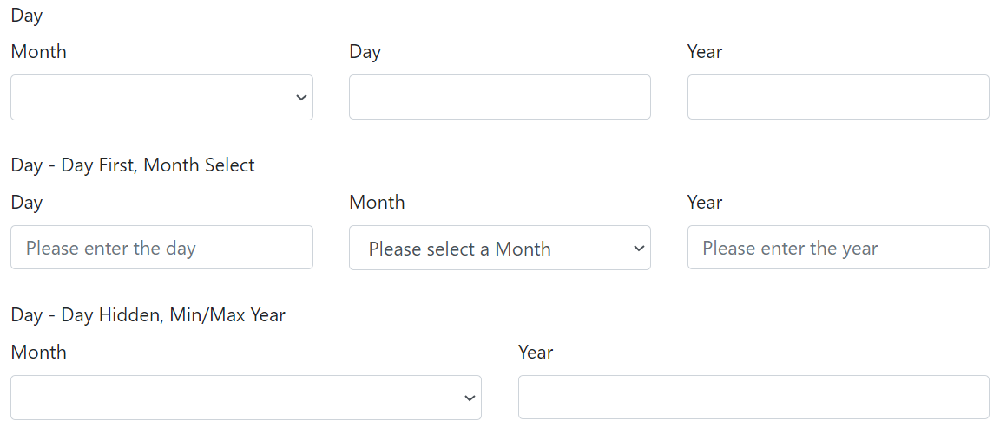
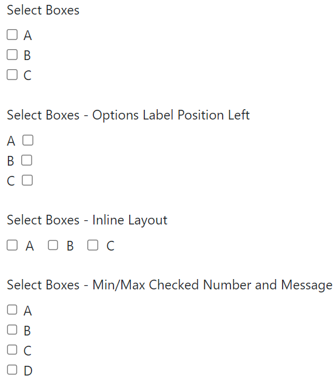
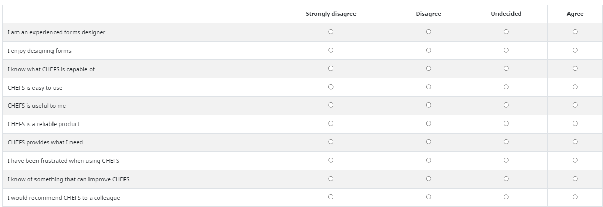

[Home](index) > [CHEFS Components](CHEFS-Components) > [Form Builder Components](Form-Builder-Components) > **Advanced Fields**
***

|  | Advanced Fields in form builders are an extension of Basic Fields, specifically designed to cater to more complex requirements. They offer additional features, functionality, or customization options beyond what the Basic Components provide |
|----------|----------|

**Page content:**

* [Text Field](#text-field)
* [Email](#email)
* [Text Area](#text-area)
* [Url](#url)
* [Number](#number)
* [Phone Number](#phone-number)
* [Tags](#tags)
* [Address](#address)
* [Password](#password)
* [Date Time](#date-time)
* [Checkbox](#checkbox)
* [Day](#day)
* [Time](#time-1)
* [Select Boxes](#select-boxes)
* [Select](#select)
* [Currency](#currency)
* [Radio](#radio)
* [Button](#button)
* [Survey](#survey)
* [Signature](#signature)

## Text Field
**[Back to top](#top)**

The Text/Images input field is a versatile option for entering short and general text. It provides rules and validations to manage and format the information based on specific requirements. It also offers additional features like multiple masks, label hiding, word/character counters, spellcheck, and disabled mode for added functionality.

 

## Email
**[Back to top](#top)**

The Email component is a string field that carries special input validation ensuring the entered data is in a valid email format. A valid email address consists of an email prefix and an email domain, both in acceptable formats.

## Text Area
**[Back to top](#top)**

The Text Area input field is an enhanced version of a multi-line input field with (Basic layout). It enables users to enter multiple lines of text, making it ideal for longer messages, descriptions, or comments.

In addition to the basic functionality, the Text Area offers several advanced features:

* Hidden: It can be hidden from view.
* Hide Label: The label associated with the Text Area can be hidden.
* Show Word Counter: It displays a counter indicating the number of words entered.
* Show Character Counter: A counter indicates the number of characters entered.
* Initial Focus: It can be set to receive focus when the page loads automatically.
* Allow Spellcheck: It enables spellcheck for the entered text.
* Disabled: It can be disabled, preventing any user interaction.
* Table View: It can be displayed in a table format.
* Modal Edit: It can be edited within a modal window.

## Url
**[Back to top](#top)**

Similar to the Email field, the URL component is a string field that carries special input validation ensuring the entered data is in a valid URL format. Validation will check to see if the entered input data is at least in the correct format to be a legitimate URL potentially.

## Number
**[Back to top](#top)**

Use a Number field whenever a field should be limited to a number value type. There are options to set thousands separators,  decimal places, and decimal requirements.

## Phone Number
**[Back to top](#top)**

The Phone Number field carries an input mask to force the user to enter the field data in Phone Number format.

## Tags
**[Back to top](#top)**

The Tag component draws attention to or categorizes elements on your form. Multiple tags can be added to one Tag field.

## Address
**[Back to top](#top)**
The Address component is a special component that performs an address lookup based on user input using several map and location providers as well as Custom Provider support. Address data can also be entered in free form and will save the address as well as geolocation and other metadata.

  
<strong>Unique Settings</strong>

  
**Enable Manual Mode:**
Checking this setting adds a checkbox under the Address field. Should the user check this, the address lookup through the location provider is disabled, and the traditional address field will display for manual input (Address, City, State, Zip etc)

**Switch To Manual Mode Label**: The label of the checkbox used for the 'Enable Manual Mode' setting. 

**Disable Clear Icon:** Removes the 'x' clear icon found at the far right of the field. You may want to check this setting to prevent any users from accidentally clicking the icon. 

## Providers
Form.io is integrated with several Location and Map providers for fast and easy address lookup and geolocation data. 

**Azure Maps:** Set up your own [Azure Map](https://learn.microsoft.com/en-us/azure/azure-maps/) account and provide the subscription key to enable this map provider.
 
**Open Street Map Nominatim:** [Nominatim](https://nominatim.org/release-docs/latest/) is a tool to search OSM data by name and address and to generate synthetic addresses of OSM points

Custom: Provides settings to integrate your own custom map provider.

**Google Maps:** Set up a Google Map API to utilize Google's location and map technology.

**Manual Mode View String:** Specify the template to be used when querying the view string for component values entered in manual mode. This string is used in the table view, CSV export, and email rendering. When left blank combined value of all components joined with a comma will be used.

## Password
**[Back to top](#top)**

The password field has the same options as a text field component. It differs from a text field in that its HTML <input> type will be password instead of text. This will cause the field to display hidden input symbols instead of the entered value.

## Date Time
**[Back to top](#top)**

The Date/Time component is a powerful and flexible component that offers many options for validation, date ranges, and calculations.

  
<strong>Unique Settings</strong>

  
### **Display In Timezone:** 

This will display the captured date time in the selected timezone.
* Of Viewer
* Of Submission
* Of Location
* UTC

**Use Local Settings:** Use the Date/Time of your local machine

**Allow Manual Input:** Set by default, this setting will allow you to use your keyboard to input the value. When unchecked, the user will only be able to select the Date and Time from the calendar widget.

**Format:** The format the Date/Time will display in. By default, the format will be set to:
yyyy-MM-dd hh:mm a

Use formats provided by [DateParser Codes](https://github.com/angular-ui/bootstrap/tree/master/src/dateparser/docs#uibdateparsers-format-codes) for more options 

### Date

**Enable Date Input: **Enables selectable dates in the calendar widget and user input.

**Disable Specific Dates**: Blacklist certain dates by providing a date in the following format:
(yyyy-MM-dd) or (yyyy-MM-dd - yyyy-MM-dd)

**Custom Disabled Dates:** Write Javascript to customize your disabled dates

// Disable all weekends
date.getDay() === 0 || date.getDay() === 6
Disable Weekends/Weekdays: Disables the selected days from the calendar picker. 

### Time

**Enable Time Input:** Enable or Disable the time input.

**Hour/Minute Increment:** Change the increment value when selecting a time from the Calendar Widget using the increment buttons. 
12 Hour Time (AM/PM): Display time in 12-hour time with AM/PM.

### Data

Flatpickr options: add new/override current Flatpickr options.
This field can be used to set the options of Flatpickr library, that is used to create the datepicker widget. A full list of the options can be found [here](https://flatpickr.js.org/options/).

It can also be used to set a translation for the datepicker. To do so, the user has to provide a value to the locale variable. In the following example, translation is set to French with the shorthand name of the locale:

{ "locale": "fr" }

FuA fullll list of the available locales and their shorthand names can be found [here](https://github.com/flatpickr/flatpickr/tree/master/src/l10n).

### Validation

Default Date: Set a default Date and Time when a user renders the form. Utilize Moment.JS to set dynamic date ranges.
For example, this code will default the date to 10 days prior to the current date.

moment().subtract(10, 'days')

**Use Calendar To Set Min/Max Date:** 
Click in the setting field to open a Calendar to pick the minimum or maximum date. 

**Use Moment.js** To Set Min/Max Date: Check this if you would rather use Moment.js to set your dates rather than the calendar picker

## Checkbox
**[Back to top](#top)**

A check box can be used for boolean value input field. It can either be checked (true) or unchecked (false). There are options to set Shortcut and Input Type.

  
<strong>Unique Settings</strong>

  
 **Shortcut:**  Add a keyboard shortcut to check/uncheck the component.

**Input Type:** The input type can be changed from a single input value checkbox or a multi-valued radio component. 

## Day
**[Back to top](#top)**

The Day component provides a way to input values for the day, month, and year using either a numeric or dropdown selection field.
This component offers enhanced functionality compared to the basic version.

  
<strong>Unique Settings</strong>

  
**Hide Input Labels:** Hide the labels of component inputs. Labels will be visible when using the Form Builder but hidden when the form is rendered. 

Type of Input: Determines the type of input the user will use for the field.
Numer - User inputs a number to represent the field
Select - User will select a value relative to the field.

**Hidden:** When checked, this specific field will be hidden from the set of Day components

**Day First:** When checked, the day field will display first from the set of Day components

**Placeholder:** Text displayed inside the field and removed when there is user input.

## Time
**[Back to top](#top)**

The stand-alone time field allows for manual input or can be replaced with a time selector widget for easier selection.

## Select Boxes
**[Back to top](#top)**

This multi-valued component enables users to select one or multiple options in a checkbox-style format. You can configure the values within the Data tab of the settings. Additionally, you can apply unique settings such as value shortcuts and min/max value validation.

  
<strong>Unique Settings</strong>

**Values** - Set the options that can be picked for this component. Label is the front-end identifier and the Value is the backend identifier for the option. 
When setting the option value, use only Strings or Numeric values. 

**Shortcut** - Add a keyboard shortcut for the designated option.

**Options Label Position:** Determines the position of the option label relative to it's checkbox

**Inline Layout:** Displays the option values horizontally

**Min/Max Checked Number:** Validation that determines the minimum and maximum amount of options to check. Checked options below the minimum will trigger front-end validation. When the maximum amount of options is checked, the remaining options will become disabled. 

**Min/Max Checked Error Message:** Determines the validation message displayed to the user for the minimum or maximum option amount.
  

## Select
**[Back to top](#top)**

The Select component displays a list of values in a dropdown list where users can select one of the values. This component has flexibility on where the data source originates from. There is also a large offering of settings providing different ways of filtering, querying, and loading data values.  

  
<strong>Unique Settings</strong>

**Widget Type:** Change the Select dropdown widget type:
[Choices.js](https://choices-js.github.io/Choices/)
[HTML 5](https://developer.mozilla.org/en-US/docs/Web/HTML/Element/select)

**Unique Options:** Display only unique dropdown options removing repeated values.

**Multiple Values:** Allows the user to select more than one option. Options are saved like tags on the field when the setting is enabled.

**Data Source Type:** The source to use for the Select component options: 

**Value, URL, Resource, Raw JSON**, and Custom. 

**Storage Type:** Select how you want the field data to be stored. Defaults to 'Autotype' if an option is not selected:
String, Number, Boolean, Object

**ID Path:** Designate the path to select the option ID

**Item Template:** HTML template that determines how the Select options are displayed within the dropdown. You can use the item variable to access the current object in the array. 
EG embed the value by using {{ item.value }} in a template.

**Lazy Load Data** - When set, a request will not be fired to the URL until this control is within focus. This can improve performance if you have many Select dropdowns on your form where the APIs will only fire when the field is activated.

**Request Headers:** Set any headers that should be sent along with the request to the url, useful for authentication.

**Data Path:** The property within the source data, where iterable items reside. 
For example: results.items or results[0].items

**Value Property:** The property of each item in the data source to use as the select value. If not specified, the item itself will be used.

**Disable Limiting Response:** When enabled, the request will not include the limit and skip options within the query string. This can help with unnecessary requests and performance. 

**Search Query Name:** The name of the search query string parameter used when sending a request to filter results with. The server at the URL must handle this query parameter. If URL or Resource is selected as Data Source Type, enter the name of the search query parameter to filter requests with. 
Example, if your URL is http://api.dogs.com/dogs, and Search Query Name is set to type, and then the user types nice in the Select field, then this component will send a request to http://api.dogs.com/dogs?type=nice and update the Select items with the results. If this option is omitted, no new requests will be made when a user enters text in the select field.

**Search Delay Request:** The delay in seconds before the search request is sent, measured from the last character input in the search field.
Default is set to 0.3

**Filter Query:** Provide additional filtering within the dropdown using query parameters.

**Sort Query:** Provide additional sorting within the dropdown using query parameters

**Limit:** Use this to limit the number of items to request or view.

**Formio Authenticate:** Check this if you would like to use Formio Authentication with the request.

**Disables Storing Request Result in the Cache:** Check it if you don't want the requests and their results to be stored in the cache. By default, it is stored and if the Select tries to make the request to the same URL with the same parameters, the cached data will be returned. It allows to increase performance, but if the remote source's data is changing quite often and you always need to keep it up-to-date, uncheck this option.

**Refresh Options On:** Refresh the field options based on a change from another field on the form, or any change on the form. This is helpful when dealing with dynamic values, such as the [Cascading Select Dropdowns](https://github.com/faq/tutorials-and-workflows/cascading-select-dropdowns)

**Refresh Options On Blur:** Refresh the field options when a specific field or any field on the form is blurred. 
Clear Value Option On Refresh: Clears any selected value if the field is reset by the Refresh Options On setting.

**Enable Static Search:** When checked, the select dropdown will allow for searching within the static list of items provided.

**Search Threshold:** Determines when the select component match algorithm gives up. A threshold of 0.0 requires a perfect match, a threshold of 1.0 would match anything. This setting is set to 0.3 by default.

**Read Only Value:** Check this if you would like to only display the value when in Read Only mode.
Choices.js options: A raw JSON object to use as options for the Select component. Refer to the [Choices.js documentation](https://github.com/Choices-js/Choices#readme) for more information.

**Use Exact Search:** Disables the Search Algorithm and only allows exact searches to return an option.

  

## Currency
**[Back to top](#top)**

Use the Currency component when a field should display currency amounts on the field. This component holds a numeric input mask that allows two decimal values and automatically adds commas as a user inputs a currency amount. The type of currency can also be selected which will change the prefix currency symbol.

## Radio
**[Back to top](#top)**

The radio component is a field that allows users to select a single option from a list of options displayed in radio-style format. Users can click a selected option to deselect it, returning the field back to its original state.

  
<strong>Unique Settings</strong>

  
 Values - Set the options that can be picked for this component. Label is the front-end identifier and the Value is the backend identifier for the option. 

When setting the option value, use only Strings or Numeric values. 

Shortcut - Add a keyboard shortcut for the designated option.

Options Label Position: Determines the position of the option label relative to the option bubble

Inline Layout: Displays the option values horizontally

## Button
**[Back to top](#top)**

Buttons can be added to perform various actions within the form. The most obvious function of the Button component is the Submission action. However, you can also utilize the Button component to trigger events associated with workflow logic, reset field data, authenticate to an OAuth provider, and more. 
In addition to functionality, the button component offers many settings to change the style and theme of the component

  
<strong>Unique Settings</strong>

  
Action: The functionality that executes when the button is clicked. Click the event to show additional settings related to the selected action:

Submit - Submits the form to the back-end server

Save In State - This button action works alongside the Save In State workflow and facilitates a 'Save as Draft' workflow. 

Inheritently the action will bypass validation giving the submission a different state.

Reset - Reset all fields on the form back to their pristine state

Event - Triggers an 'event' on the form which is usually correlated to application logic or form workflow logic

Oauth - Opens an OAuth authentication popup. This will only work after it has been assigned to an [OAuth Action](https://github.com/userguide/form-building/actions#oauth). 

See the [OAuth guide](https://github.com/developers/integrations/auth/oauth) for more information on how to set up OAuth in your project.
Post to URL - 

Custom - Write custom code to fire 

Save On Enter: Use the Enter key to submit the form

Theme: Set a theme (color) for the button mapped to [Bootstrap](https://getbootstrap.com/docs/4.6/components/buttons/) classes 

Size: Determines the position of the option label relative to the option bubble

Block Button: Spans the button horizontally across the form

Left/Right Icon: Set an icon to the left or right side of the button label using [Font Awesome](https://fontawesome.com/search) icon classes.

Disable on Form Invalid: If any field on the form is invalid, disable the button.

## Survey
**[Back to top](#top)**

The Survey component works similarly to the radio. Instead of one question, users are able to select a value for multiple questions which are configured within the component settings. Survey is a great component to utilize when asking multiple questions with the same context of answers or values.

  
<strong>Unique Settings</strong>

  
**Questions:** The questions presented to the user, displayed vertically in the left-hand column

**Values:** Values are the answer that can be selected for each question.

**Tooltip:** Add a tooltip to any of the Questions or Values to help better communicate with your users. 

## Signature
**[Back to top](#top)**

The Signature component allows the end-user to digitally sign a signature pad with either their finger on a touch-enabled device or with the mouse pointer.  When the form is submitted, the Signature pad will be converted into an image and stored with the form submission.

***
- [Basic Layout](Basic-Layout) 
- [Basic Fields](Basic-Fields) 
- [Advanced Layout](Advanced-Layout) 
- **Advanced Fields**
- [Advanced Data](Advanced-Data)
- [BC Government](BC-Government)