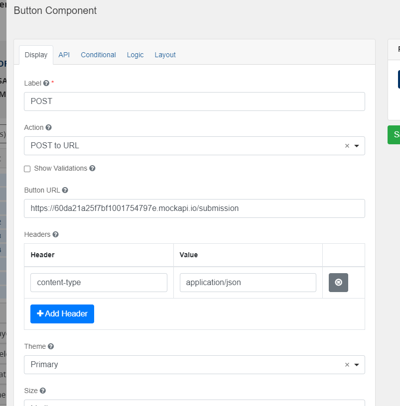
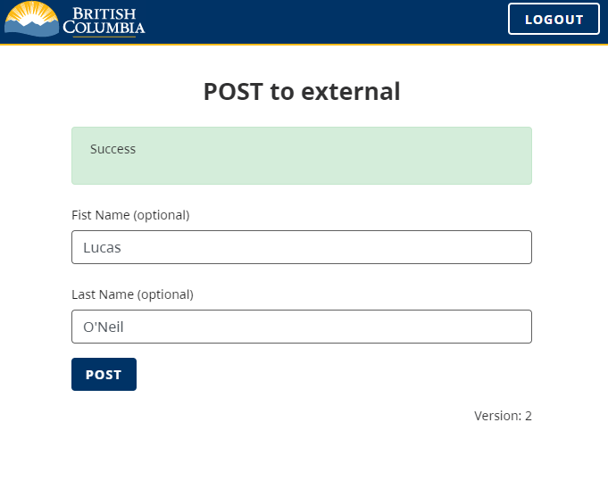

[Home](index) > [Capabilities](Capabilities) > [Data Management](Data-Management) > **Sending to an external systems**
***

CHEFS forms can be used to save data into the CHEFS backend by default, but can also be modified to POST the data to an external (open) API if desired.

>Note: this functionality can only be used for open (unsecured) API endpoints. Never put secure credentials in a form control, as a user would be able to inspect their browser and access those credentials

<!-- **On this page:**
* [Modify button behaviour](#modify-button-behaviour)
* [Set POST options](#Set-POST-options)
* [Post](#Post) -->

## Modify button behaviour
Build your form as required and edit the button at the bottom.

To change the default submit button behaviour, edit the button on your form (or you can drag in a new button.
)

## Set POST options
<!-- **[Back to top](#top)** -->

On the `Display` tab you will modify the properties to change the button behaviour

**Label**: Set to whatever text you want the user to see (or leave as the default 'SUBMIT')

**Action**: Change to the `POST to URL` action

**Show Validations**: You can choose whether to enforce form field validations before posting to the URL.

**Button URL**: This is the *open* endpoint on the external system to POST to. 

**Headers**: You can set header fields required by the api endpoint. Content-type will default to application/text if not specified.  
**Do not specify any secure authentication headers here. They will be accessible in the front end of the resultant form. Only use this for unsecured endpoints**

## POST
<!-- **[Back to top](#top)** -->

When the user clicks your edited button, no network calls to the backend of CHEFS will be invoked. You can see the only resultant network activity will be a POST to your specified endpoint.

After the POST occurs, the interface will show `Success` to the user.

***
[Terms of Use](Terms-of-Use) | [Privacy](Privacy) | [Security](Security) | [Service Agreement](Service-Agreement) | [Accessibility](Accessibility)
