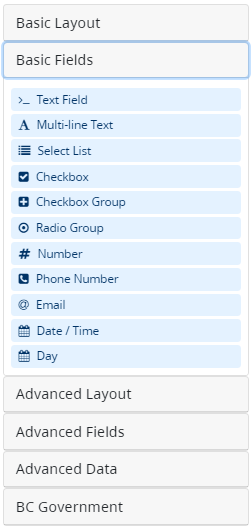
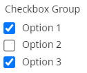

[Home](index) > [CHEFS Components](Components) > [Form Builder Components](Form-Builder-Components) > **Basic Fields**
***

|  | The basic fields in the Form Builder are commonly used in traditional web forms. You'll likely be familiar with these components if you've used a Form Builder before.  |
|----------|----------|

<!-- **Page content:**

* [Text Field](#text-field)
* [Multi-Line Text](#multi-line-text)
* [Select List](#select-list)
* [Checkbox](#checkbox)
* [Checkbox Group](#checkbox-group)
* [Radio Group](#radio-group)
* [Number](#number)
* [Phone Number](#phone-number)
* [Email](#email)
* [Date Time](#date-time)
* [Day](#day) -->

## Text Field
<!-- **[Back to top](#top)** -->

 A Text Field can be used for short and general text input. There are options to define input masks and validations, allowing users to develop information into desired formats.

## Multi-Line Text 
<!-- **[Back to top](#top)** -->

A multi-line input field, also known as a Text Area, provides users with a larger space to input and edit text compared to a regular single-line Text Field. It allows users to enter multiple lines of text, making it suitable for longer messages, descriptions, or comments.

## Select List
<!-- **[Back to top](#top)** -->

A select list field, also known as a dropdown or drop-down list, is a user interface component that presents a list of predefined options for selection. It allows users to choose one option from a list of available choices.

## Checkbox
<!-- **[Back to top](#top)** -->

A checkbox is a user interface element used for binary selections. Users can click on the checkbox to toggle between a checked and unchecked state. It is commonly used to represent options or preferences that users can select or deselect with a simple click.  If you need an advanced version that supports more functionalities, please check the [Advanced Checkbox](Advanced-Fields)

## Checkbox Group
<!-- **[Back to top](#top)** -->

A Checkbox group field is a collection of checkboxes allowing users to select multiple options simultaneously. Users can choose from a predefined set of choices by clicking on the checkboxes.

## Radio Group
<!-- **[Back to top](#top)** -->

A Radio group field presents a set of mutually exclusive options where users can select only one choice. It typically consists of a list of radio buttons, each representing an option. Users can select their preferred option by clicking on the corresponding radio button. Radio group fields are commonly used in forms and surveys where users need to choose a single option from a predefined set of choices.

## Number
<!-- **[Back to top](#top)** -->

Use a Number field whenever a field should be limited to a number value type. There are options to set thousands separators,  decimal places, and decimal requirements.

## Phone Number
<!-- **[Back to top](#top)** -->

The Phone Number field includes an input mask that requires users to enter the data in a specific phone number format. This ensures that the entered information adheres to the standard phone number format.

## Email
<!-- **[Back to top](#top)** -->

The Email component is a string field that carries special input validation ensuring the entered data is in a valid email format. A valid email address consists of an email prefix and an email domain, both in acceptable formats.

## Date Time
<!-- **[Back to top](#top)** -->

The Basic Date/Time component offers a few options for validation, date ranges, and calculations. If you need an extended version that supports more functionalities, please check the [Advanced Date/Time](Advanced-Fields#date-time)
 

## Day
<!-- **[Back to top](#top)** -->

The Day component is used to enter values for the Day, Month, and Year using a number or select type of field.

***

- [Basic Layout](Basic-Layout) 
- **Basic Fields**
- [Advanced Layout](Advanced-Layout) 
- [Advanced Fields](Advanced-Fields) 
- [Advanced Data](Advanced-Data)
- [BC Government](BC-Government)

***
[Terms of Use](Terms-of-Use) | [Privacy](Privacy) | [Security](Security) | [Service Agreement](Service-Agreement) | [Accessibility](Accessibility)