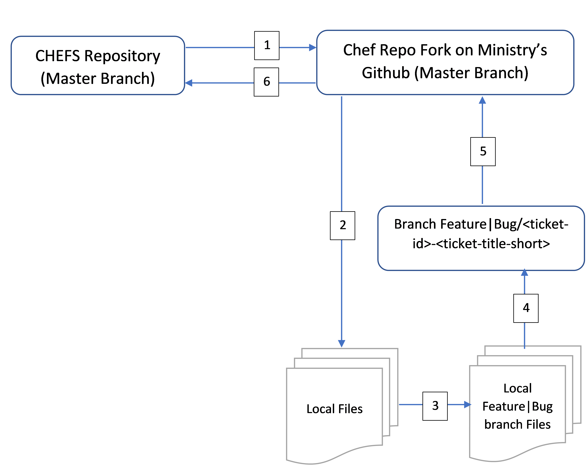
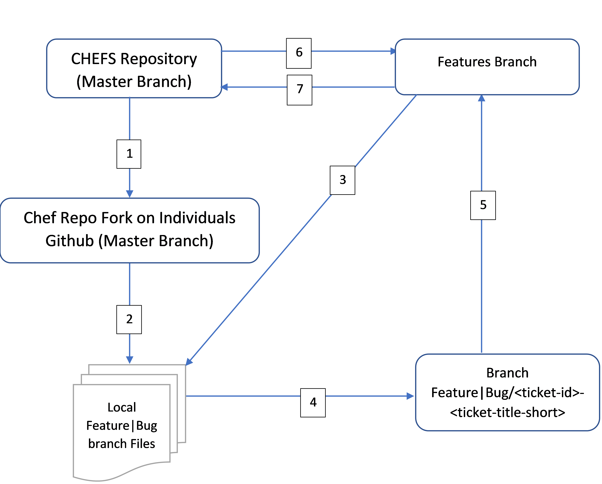
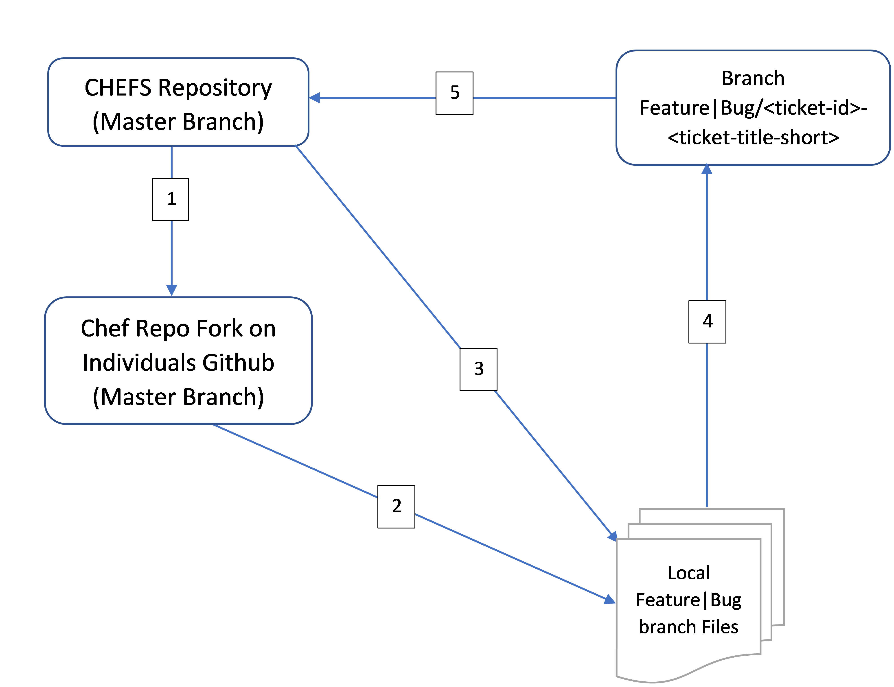

[Home](index) > [Developer](Developer) > [Contributors](Contributors) > **Forking Repository**
***

## Forking Repository

A fork is a copy of a repository that you want to make changes to. Instead of using a single Git repository as the "central" codebase, forking a repository gives every developer their Git Repositories. Each contributor has two Git repositories: private local, and public.

The advantage of the forked repository is that contributions can be integrated without needing everybody to push to a single central repository. Developers push to their git repositories, and only the administrator of the original repository can merge the forked repositories. The administrator accepts developers' commits without giving them written access to the official repository.

Note: The options below are suggestions on how Forminator partners can fork CHEFS Repository and manage their forked repository.

### First Option:

* Create a fork of CHEFS repository into the Ministry's Github.[Git Branching and Pull Request Workflow](https://bcdevex.atlassian.net/wiki/spaces/CCP/pages/963117057) 

* Clone forked repo.

git clone https://github.com/MinistryA/common-hosted-form-service.git - Connect your Github account 

* Create a feature|bug fix branch.

git checkout -b  feature/<ticket id>-<ticket-title-short>

* Push local changes to remote feature|bug branch.

git add 

git commit -m "your commit message here"

git push

* When ready, create PR to merge changes from the feature|bug branch to the master of the forked repo.

* Create PR from the Forked branch to the main CHEFS Repository master branch.

### Second Option:

* Create a fork of CHEFS repository into the individual developer's Github. 

[Git Branching and Pull Request Workflow](https://bcdevex.atlassian.net/wiki/spaces/CCP/pages/963117057) 

* Create a feature|bug fix branch.

git checkout -b  feature/<ticket id>-<ticket-title-short>

Before pushing local changes, update local changes with the remote features branch.

git pull origin features

* Push or publish local changes to feature|bug fix branch.

git add .

git commit -m "your commit message here"

git push

* When ready, create PR to merge changes from the feature|bug branch to the CHEFS Repository features branch.

* Before creating PR from the feature branch, update it with the master branch.

git fetch origin features

git switch features

git pull origin

* Create PR from the feature branch to the main CHEFS Repository master branch.

### Third Option

* Create a fork of CHEFS repository into the individual developer's Github. 

[Git Branching and Pull Request Workflow](https://bcdevex.atlassian.net/wiki/spaces/CCP/pages/963117057) 

* Create a feature|bug fix branch.

git checkout -b  feature/<ticket id>-<ticket-title-short>

* Before pushing/publishing the feature|bug branch to remote, update it with the master branch.

git pull origin

* Push or publish local changes to feature|bug fix branch.

git add .

git commit -m "your commit message here"

git push

* Create PR from the feature branch to the main CHEFS Repository master branch.

