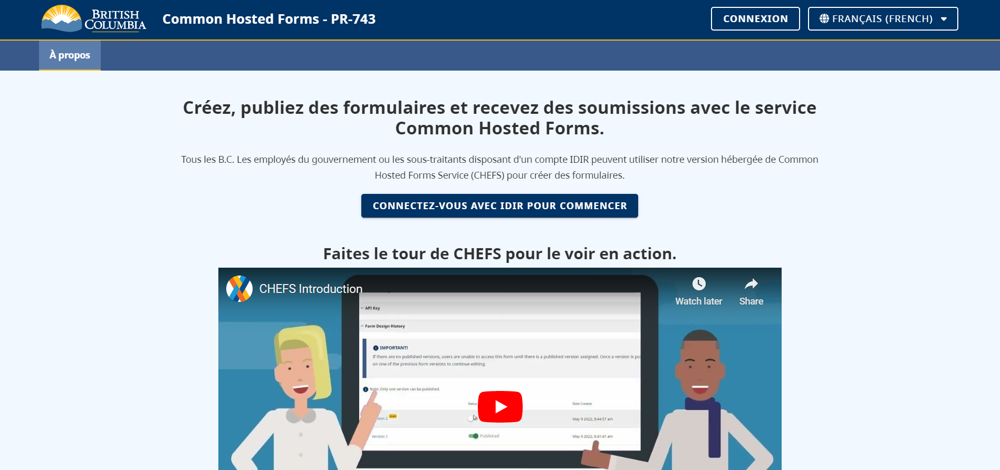
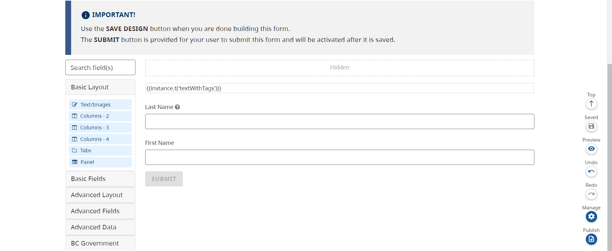
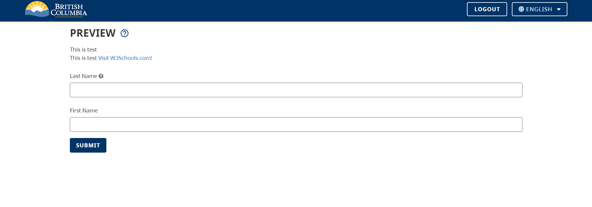

[Home](index) > [CHEFS Capabilities](CHEFS-Capabilities) > **Form multilanguage**
***

## Internationalization
> can be referred to as the design and development of the content, of a product, application, or document, so that it can be localized for target audiences that vary in culture, region, or language. It can also be referred to as the process of designing software to support multiple languages, cultures, and regions.
>
> It involves considering various aspects of software development, such as user interface, data storage, and communication protocols, to ensure they are compatible with different languages and cultural norms. The benefits or importance of internalization is that
   1. it enhances user experience,
   2. it meets legal requirements,
   3. it improves localization, and
   4. it expands reach.

<details>
<summary> Supported language translations</summary>

   - Arabic : keyword: 'ar'
   - German : keyword: 'de'
   - English : keyword: 'en'
   - Español (Spanish) : keyword: 'es'
   - فارسی (Farsi) : keyword: 'fa'
   - Français (French) : keyword: 'fr'
   - हिंदी (Hindi) : keyword: 'hi'
   - Italian : keyword: 'it'
   - 日本語 (Japanese) : keyword: 'ja'
   - 한국어 (Korean) : keyword: 'ko'
   - ਪੰਜਾਬੀ (Punjabi) : keyword: 'pa'
   - Portuguese: keyword: 'pt'
   - Русский (Russian) : keyword: 'ru'
   - Tagalog (Filipino) : keyword: 'tl'
   - Українська (Ukrainian) : keyword: 'uk'
   - Tiếng Việt (Vietnamese) : keyword: 'vi'
   - 简体中文 (Simplified Chinese) : keyword: 'zh'
   - 繁體中文 (Traditional Chinese) : keyword: 'zhTW'

</details>

<details>
<summary>Example</summary>
The example below shows the CHEFS homepage in the English language, and after the language switch to the French language, it shows looks like in the French Language.



</details>

### How to add translations to your form

The following steps will give the basic structure for doing translation of the content that will be in your form. The effort to actually write the translations for each block of text is still up to you to do.  If you want to try it out, you can start with some simple sentences that don't have a complex grammatical structure, and are free of acronyms and words that might only make sense within the context of your organization or specialized body of knowledge.

This example will allow you to switch the translation for the words "First Name" and "Last Name" between French and English:

   1. Drag the component called "Hidden" onto your Form (this is found on the "Advanced Data" section)
   2. In the logic tab of the component, click on the "Add Logic" button
   3. For the Logic Name field let's type "translations"
   4. For the Trigger type, select "javascript"
   5. copy and paste the code below into the Text Area of the javascript

```
   const { root} = instance;
   const i18 = root.i18next;
   i18.addResources("en", "translation", {"Last Name": "Last Name", "First Name": "First Name" });
   i18.addResources("fr", "translation", {"Last Name": "Nom de famille", "First Name": "Prénom" });
```
   6. Add more language(s) by copying and pasting a new line to the end of the file,
   7. Change "fr" to the [shortcode](https://support.microsoft.com/en-us/topic/country-region-and-language-codes-add36afe-804a-44f1-ae68-cfb9c9b72f8b) of the languages you want in your translation
   8. put in the comma separated list of translations ("English phrase" : "translated phrase",)

If you had lots of phrases to translate you can use this alternate formatting:
<details>
<summary> show code </summary>

```
   const { root} = instance;
   const i18 = root.i18next;
   // repeat this section for each language
   i18.addResources("en", "translation", {
      "First Phrase": "First translated phrase", // repeat one of these lines for each translated phrase
      "Second Phrase": "Second translated phrase",
      "Third Phrase": "Third translated phrase" // last translation line has no comma
   });
   // end repeat section for each language
```
</details>

If you want the sample code for the top 14 languages in BC you copy the following code to get you started:

<details>
<summary>Show code</summary>

```json
const { root } = instance;
const i18 = root.i18next;

// English translations
i18.addResources("en", "translation", {
  "First Phrase": "First translated phrase",
  "Second Phrase": "Second translated phrase",
  "Third Phrase": "Third translated phrase",
  "Last Name": "Last Name",
  "First Name": "First Name"
});

// French translations
i18.addResources("fr", "translation", {
  "First Phrase": "Première phrase traduite",
  "Second Phrase": "Deuxième phrase traduite",
  "Third Phrase": "Troisième phrase traduite",
  "Last Name": "Nom de famille",
  "First Name": "Prénom"
});


// Arabic translations
i18.addResources("ar", "translation", {
  "First Phrase": "العبارة المترجمة الأولى",
  "Second Phrase": "العبارة المترجمة الثانية",
  "Third Phrase": "العبارة المترجمة الثالثة",
  "Last Name": "الكنية",
  "First Name": "الاسم الأول"
});

// Chinese (Simplified) translations
i18.addResources("zh", "translation", {
  "First Phrase": "翻译后的第一句",
  "Second Phrase": "翻译后的第二句",
  "Third Phrase": "翻译后的第三句",
  "Last Name": "姓氏",
  "First Name": "名字"
});

// Chinese (Traditional) translations
i18.addResources("zhTW", "translation", {
  "First Phrase": "翻譯後的第一句",
  "Second Phrase": "翻譯後的第二句",
  "Third Phrase": "翻譯後的第三句",
  "Last Name": "姓氏",
  "First Name": "名字"
});

// German translations
i18.addResources("de", "translation", {
  "First Phrase": "Erster übersetzter Satz",
  "Second Phrase": "Zweiter übersetzter Satz",
  "Third Phrase": "Dritter übersetzter Satz",
  "Last Name": "Nachname",
  "First Name": "Vorname"
});

// Hindi translations
i18.addResources("hi", "translation", {
  "First Phrase": "पहला अनुवादित वाक्य",
  "Second Phrase": "दूसरा अनुवादित वाक्य",
  "Third Phrase": "तीसरा अनुवादित वाक्य",
  "Last Name": "उपनाम",
  "First Name": "नाम"
});

// Italian translations
i18.addResources("it", "translation", {
  "First Phrase": "Prima frase tradotta",
  "Second Phrase": "Seconda frase tradotta",
  "Third Phrase": "Terza frase tradotta",
  "Last Name": "Cognome",
  "First Name": "Nome"
});

// Japanese translations
i18.addResources("ja", "translation", {
  "First Phrase": "最初の翻訳されたフレーズ",
  "Second Phrase": "2番目の翻訳されたフレーズ",
  "Third Phrase": "3番目の翻訳されたフレーズ",
  "Last Name": "姓",
  "First Name": "名"
});

// Korean translations (continued)
i18.addResources("ko", "translation", {
  "First Phrase": "첫 번째 번역된 구절",
  "Second Phrase": "두 번째 번역된 구절",
  "Third Phrase": "세 번째 번역된 구절",
  "Last Name": "성",
  "First Name": "이름"
});

// Persian (Farsi) translations
i18.addResources("fa", "translation", {
  "First Phrase": "اولین عبارت ترجمه شده",
  "Second Phrase": "دومین عبارت ترجمه شده",
  "Third Phrase": "سومین عبارت ترجمه شده",
  "Last Name": "نام خانوادگی",
  "First Name": "نام"
});


// Portuguese translations
i18.addResources("pt", "translation", {
  "First Phrase": "Primeira frase traduzida",
  "Second Phrase": "Segunda frase traduzida",
  "Third Phrase": "Terceira frase traduzida",
  "Last Name": "Último Nome",
  "First Name": "Primeiro Nome"
});

// Punjabi translations
i18.addResources("pa", "translation", {
  "First Phrase": "ਪਹਿਲਾਂ ਅਨੁਵਾਦਿਤ ਵਾਕ",
  "Second Phrase": "ਦੂਜਾ ਅਨੁਵਾਦਿਤ ਵਾਕ",
  "Third Phrase": "ਤੀਜਾ ਅਨੁਵਾਦਿਤ ਵਾਕ",
  "Last Name": "ਆਖਰੀ ਨਾਂ",
  "First Name": "ਪਹਿਲਾ ਨਾਂ"
});

// Russian translations
i18.addResources("ru", "translation", {
  "First Phrase": "Первая переведенная фраза",
  "Second Phrase": "Вторая переведенная фраза",
  "Third Phrase": "Третья переведенная фраза",
  "Last Name": "Фамилия",
  "First Name": "Имя"
});


// Spanish translations
i18.addResources("es", "translation", {
  "First Phrase": "Primera frase traducida",
  "Second Phrase": "Segunda frase traducida",
  "Third Phrase": "Tercera frase traducida",
  "Last Name": "Apellido",
  "First Name": "Nombre"
});


// Tagalog translations
i18.addResources("tl", "translation", {
  "First Phrase": "Unang salitang isinalin",
  "Second Phrase": "Pangalawang salitang isinalin",
  "Third Phrase": "Ikatlong salitang isinalin",
  "Last Name": "Apelyido",
  "First Name": "Pangalan"
});


// Ukrainian translations
i18.addResources("uk", "translation", {
  "First Phrase": "Перший перекладений фраза",
  "Second Phrase": "Другий перекладений фраза",
  "Third Phrase": "Третій перекладений фраза",
  "Last Name": "Прізвище",
  "First Name": "Ім'я"
});

// Vietnamese translations
i18.addResources("vi", "translation", {
  "First Phrase": "Cụm từ dịch đầu tiên",
  "Second Phrase": "Cụm từ dịch thứ hai",
  "Third Phrase": "Cụm từ dịch thứ ba",
  "Last Name": "Họ",
  "First Name": "Tên"
});

```
</details>

### How to Translate in HTML Element Component

Steps:
   1. Drag the component called "Hidden" onto your Form (this is found on the "Advanced Data" section)
   2. In the logic tab of the component, click on the "Add Logic" button
   3. For the Logic Name field let's type "translations"
   4. For the Trigger type, select "javascript"
   5. copy and paste the code below into the Text Area of the javascript
   6. in the code the variables "textWithTags1" and "textWithTags2" are used. you can change those to be more descriptive of your content.
   7. Drag another "Hidden" component onto your form (this is found on the "Advanced Data" section), and in the label field (found on the Display tab)
      add this "PreventRedraw" Also, set the default value to false.

<details>
<summary>Show code</summary>

```
const { root} = instance;
const i18 = root.i18next;
i18.addResources("en", "translation", {
     "textWithTags1":"First block of text in html element <p>learn about html formatting: <a href=\"https://www.w3schools.com\">Visit W3Schools.com!</a></p>",
     "textWithTags2":"Second block of text <p>This is a test <a href=\"[https://docs.github.com/en/get-started\](https://docs.github.com/en/get-started/)">Quickstart for writing on github</a></p>"
     // add more text blocks to translate here
});
// repeat this section for each language to translate to
i18.addResources("fr", "translation", {
     "textWithTags1":"Premier bloc de texte dans un élément HTML. <p>Apprenez le formatage HTML. <a href=\"https://www.w3schools.com\">Visitez W3Schools.com !</a></p>",
     "textWithTags2":"deuxième bloc de texte. <p>Ceci est un test. <a href=\"[https://docs.github.com/en/get-started\](https://docs.github.com/en/get-started/)">Guide de démarrage rapide pour écrire sur GitHub</a></p>"
     // add more french translated blocks of text here. remember to add a comma after the last one.
});
// end repeat this section for each language

if(data.preventRedraw==="false") {
  let comp = root.getComponent('preventRedraw');
  comp.setValue(true);
  root.redraw();
}
```
</details>

     7. In the HTML Element Component content section, copy and paste the sample code below.

<details>
<summary>Show code</summary>
```
<div> {{instance.t('textWithTags1')}} </div>
<div> {{instance.t('textWithTags2')}} </div>
```
</details>

<details>
<summary>Example Screenshots</summary>




</details>

## Languages Translation Model
The languages translated were those with higher populations in BC. For the CHEFS admin console as a minimum viable product we used some automated translation tools for a first cut, and are now having native speakers do a review of each for us. The following tables shows our progress having native speakers review.

   | Language                   | Model          | Proofread by native speaker  |
   |----------------------------|----------------|------------------|
   | Arabic (ar)                | Google & DeepL |  No              |
   | English (en)               | Google & DeepL |  No              |
   | Spanish (es)               | Google & DeepL |  No              |
   | Farsi (fa)                 | Google & DeepL |  Yes             |
   | German (de)                | Google & DeepL |  No              |
   | French (fr)                | Google & DeepL |  Yes             |
   | Hindi (hi)                 | Google & DeepL |  No              |
   | Italian (it)               | Google & DeepL |  No              |
   | Japanese (ja)              | Google & DeepL |  No              |
   | Korean (ko)                | Google & DeepL |  No              |
   | Punjabi (pa)               | Google & DeepL |  No              |
   | Portuguese (pt)            | Google & DeepL |  No              |
   | Russian (ru)               | Google & DeepL |  Yes             |
   | Filipino (tl)              | Google & DeepL |  No              |
   | Ukrainian (uk)             | Google & DeepL |  Yes             |
   | Vietnamese (vi)            | Google & DeepL |  No              |
   | Simplified Chinese (zh)    | Google & DeepL |  No              |
   | Traditional Chinese (zhTW) | Google & DeepL |  No              |

<details>
<summary> Demo </summary>

> Download this example file and [import](Importing-and-exporting-form-designs) it into your design<br>
> [example__multilangrtlsupport_schema.json](examples/example_multilangrtlsupport_schema.json)

</details>

***
[Terms of Use](Terms-of-Use) | [Privacy](Privacy) | [Security](Security) | [Service Agreement](Service-Agreement) | [Accessibility](Accessibility)

