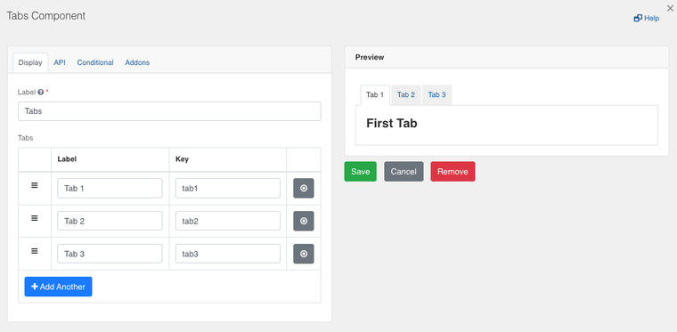
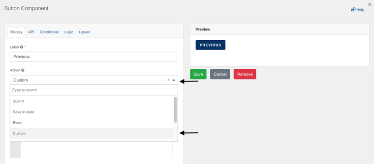
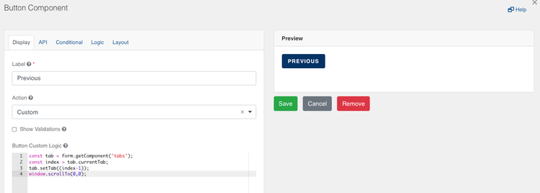

[Home](index) > [CHEFS Components](CHEFS-Components) > [Custom Components](Custom-components) > **Navigation Buttons**
***

## Examples
> Try a working example<br>
> [View example](https://submit.digital.gov.bc.ca/app/form/submit?f=3fe31d91-a802-44a4-8215-03110af26470)

<!-- > Download this example file and [import](Importing-and-exporting-form-designs) it into your design<br>
> [example_navigation_buttons_schema.json](examples/example_navigation_buttons_schema.json) -->
***

## Navigation buttons (Tutorial)

Navigation ability can be added to your forms using the 'Tabs' component and programming 'Button' components to switch those tabs.


**Step 1**: Add a 'Tabs' component to the form and customize the tabs based on your requirements. Go to the API tab and change the name of your Tabs component to `tabs`. If you want name it something else you can, but in steps 4 and 5 you will need to change the example code to reflect what you named your Tabs component.



**Step 2**: Add two 'Button' components that will switch the tabs back and forth. In this case, they are named 'Previous' with an API name of 'previous', and 'Next' with an API name of 'next'.

**Step 3**: Click on the Settings (gear) icon for each button, and select the 'Custom' option from the 'Action' dropdown in the 'Display' tab.



**Step 4**: Add the following code in the 'Button Custom Logic' section for the 'Previous' button. 

```
const tab = form.getComponent('tabs');
const newIndex = tab.currentTab - 1;

tab.setTab(newIndex);
window.scrollTo(0, 0);
```



<!-- and set the 'Previous' button to be disabled by default, since we always start on the first tab. -->

**Step 5**: Similarly, add the following code to the 'Button Custom Logic' section for the 'Next' button.

```
const tab = form.getComponent('tabs');
const newIndex = tab.currentTab + 1;

tab.setTab(newIndex);
window.scrollTo(0, 0);
```

**Step 6**: Save your changes and the buttons are now programmed to switch the tabs within the form. 

If the buttons aren't working yet, then you probably have a different value for the name of your tab group. You can either change the code to match what you have named your tab group: e.g. if I name my tab group `applicationSteps` then the code for the next button would be 
```
const tab = form.getComponent('applicationSteps');
const newIndex = tab.currentTab + 1;

tab.setTab(newIndex);
window.scrollTo(0, 0);
```

Or you can change you tab group name to match the code `tabs`.

<!-- **[Back to top](#top)** -->

***
[Terms of Use](Terms-of-Use) | [Privacy](Privacy) | [Security](Security) | [Service Agreement](Service-Agreement) | [Accessibility](Accessibility)