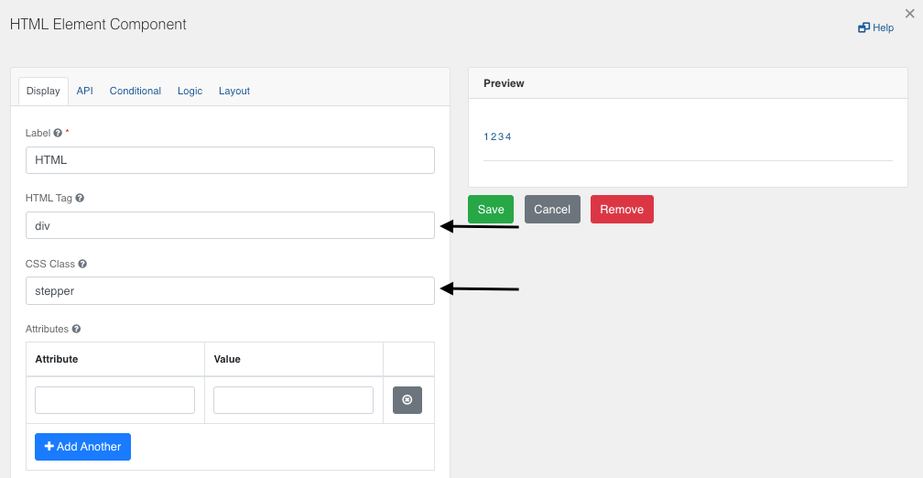
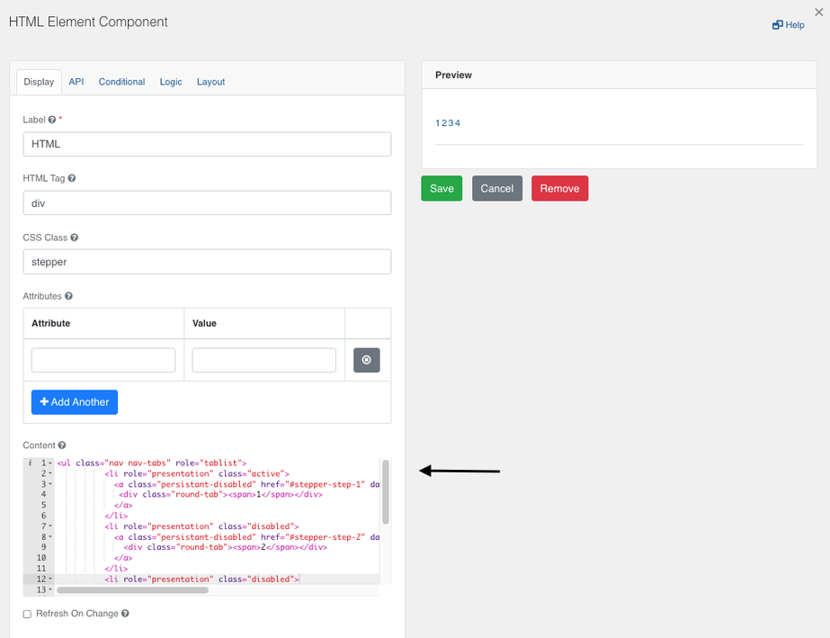
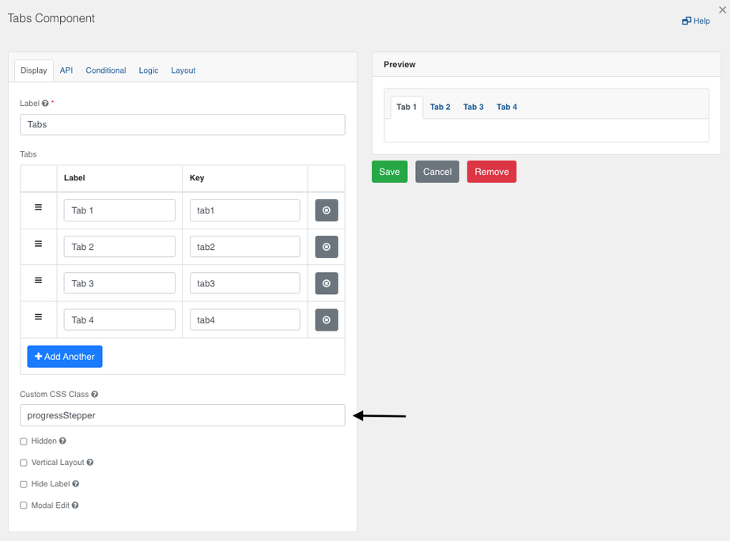
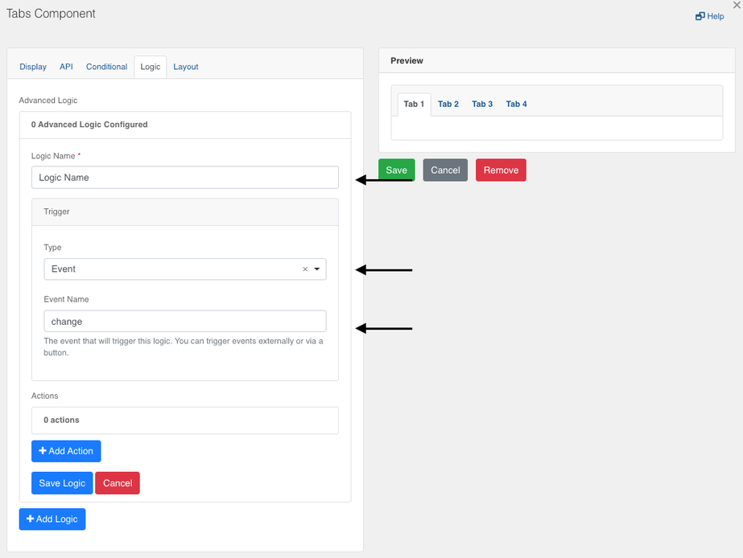
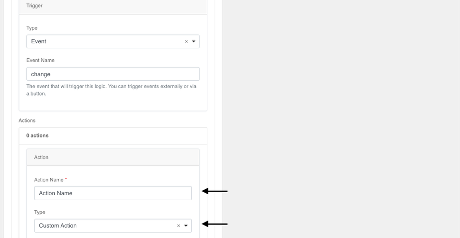
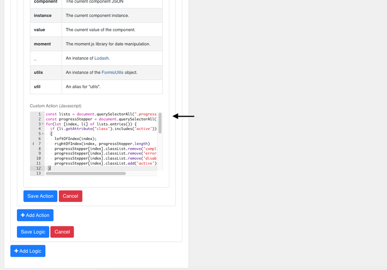

[Home](.) > [CHEFS Components](CHEFS-Components) > [Custom Components](Custom-components) > **Progress Bar**
***

## Examples
> Try a working example<br>
> [View example](https://submit.digital.gov.bc.ca/app/form/submit?f=296cb105-16f8-4dda-8d49-c83456e51345)

> Download this example file and [import](Importing-and-exporting-form-designs) it into your design<br>
> [example_progress_bar__schema.json](examples/example_progress_bar__schema.json)

***

## Progress Bar (Tutorial)

A custom progress bar can be added to the form to enhance the user experience and indicate the remaining steps within the form.


**Step 1**: Add an 'HTML Element' component from the 'Advanced Layout' into the form builder.

**Step 2**: Edit the 'HTML Tag' field from `p` to `div` in the 'Display' tab and change the 'CSS Class' to `stepper`.



**Step 3**: Copy the following code into the 'Content' section (creates 4 tabs):

```
<ul class="nav nav-tabs" role="tablist">
  <li role="presentation" class="active">
    <a class="persistant-disabled" href="#stepper-step-1" data-toggle="tab" aria-controls="stepper-step-2" role="tab" title="Step 1">
      <div class="round-tab"><span>1</span></div>
    </a>
  </li>
  <li role="presentation" class="disabled">
    <a class="persistant-disabled" href="#stepper-step-2" data-toggle="tab" aria-controls="stepper-step-2" role="tab" title="Step 2">
      <div class="round-tab"><span>2</span></div>
    </a>
  </li>
  <li role="presentation" class="disabled">
    <a class="persistant-disabled" href="#stepper-step-3" data-toggle="tab" aria-controls="stepper-step-3" role="tab" title="Step 3">
      <div class="round-tab"><span>3</span></div>
    </a>
  </li>
  <li role="presentation" class="disabled">
    <a class="persistant-disabled" href="#stepper-step-3" data-toggle="tab" aria-controls="stepper-step-3" role="tab" title="Step 4">
      <div class="round-tab"><span>4</span></div>
    </a>
  </li>
</ul>
```



**Step 4**: Navigate to the 'Logic' tab and click on the 'Add Logic' button.


**Step 5**: Enter `stepper` as the 'Logic Name' and select the 'Javascript' type from the 'Trigger' dropdown.

**Step 6**: Enter the following code in the 'Text Area' that appears:

```
const cssId = 'myCss';
const head = document.getElementsByTagName('head')[0];

if (!document.getElementById(cssId)) {
  const link = document.createElement('link');
  link.id = cssId;
  link.rel = 'stylesheet';
  link.type = 'text/css';
  link.href = 'https://bcgov-citz-ccft.github.io/forminators/customprogresssteppercss/chefsCustomCss.css';
  link.media = 'all';
  head.appendChild(link);
}
```


**Step 7**: Click on 'Save Logic' and then 'Save' the component.

**Step 8**: Next, add a 'Tabs' component from the 'Advanced Layout' and edit the tabs based on your requirements.

**Step 9**: Under the Display settings, enter `progressStepper` in the 'Custom CSS Class'.



**Step 10**: Under the 'Logic' tab, click on the 'Add Logic' button and add any 'Logic Name':


**Step 11**: In the 'Trigger' section, select the 'Event' type from the dropdown.

**Step 12**: Enter `change` as the 'Event Name'.



**Step 13**: Click on the 'Add Action' button, and enter any 'Action Name'.

**Step 14**: Select 'Custom Action' from the 'Type' dropdown.



**Step 15**: Enter the following code in the 'Custom Action (Javascript)' field:

```
const lists = document.querySelectorAll('.progressStepper ul li');
const progressStepper = document.querySelectorAll('.stepper ul li');

for (let [index, li] of lists.entries()) {
  if (li.getAttribute('class').includes('active')) {
    leftOfIndex(index);
    rightOfIndex(index, progressStepper.length);
    progressStepper[index].classList.remove('completed');
    progressStepper[index].classList.remove('errors');
    progressStepper[index].classList.remove('disabled');
    progressStepper[index].classList.add('active');
  }
}

function leftOfIndex(index) {
  for (let i = 0; i < index; i++) {
    progressStepper[i].classList.remove('active');
    progressStepper[i].classList.remove('disabled');
    progressStepper[i].classList.add('completed');
  }
}

function rightOfIndex(index, endIndex) {
  for (let i = endIndex - 1; i > index; i--) {
    progressStepper[i].classList.remove('completed');
    progressStepper[i].classList.remove('errors');
    progressStepper[i].classList.remove('active');
    progressStepper[i].classList.add('disabled');
  }
}
```



**Step 16**: Click on the 'Save Action' and 'Save Logic' buttons, and then 'Save' the component.

**Step 17**: To add the functionality to navigate the tabs with buttons while updating the progress bar, start by adding two 'Button' components onto the form. Name the buttons 'Previous' and 'Next'.

**Step 18**: Click on the Settings (gear) icon for the 'Next' button. Change the 'Action' to 'Custom' and add the following code in the 'Button Custom Logic' field.

```
const tab = form.getComponent('tabs');
const index = tab.currentTab;
const progressStepper = document.querySelectorAll('.stepper ul li');

progressStepper[index].classList.remove('active');
progressStepper[index].classList.remove('disabled');
//progressStepper[index].classList.remove('completed');
//progressStepper[index].classList.add('errors');
progressStepper[index].classList.add('completed');
progressStepper[index + 1].classList.add('active');
progressStepper[index + 1].classList.remove('disabled');

tab.setTab(index + 1);

window.scrollTo(0, 0);
```

**Step 19**: Click on the Settings (gear) icon for the 'Previous' button. Change the 'Action' to 'Custom' and add the following code in the 'Button Custom Logic' field.

```
const tab = form.getComponent('tabs');
const progressStepper = document.querySelectorAll('.stepper ul li');
const index = tab.currentTab;

progressStepper[index].classList.remove('errors');
progressStepper[index].classList.remove('completed');
progressStepper[index].classList.remove('active');
progressStepper[index].classList.add('disabled');
progressStepper[index - 1].classList.add('active');
progressStepper[index - 1].classList.remove('errors');
progressStepper[index - 1].classList.remove('completed');

tab.setTab(index - 1);

window.scrollTo(0, 0);
```

**Step 20**: Save the form and preview it to ensure everything is working as expected.

---
### Troubleshooting Validation Error


In case of a validation error like the image above, change the code for the ‘Next’ button to match:

```
progressStepper[index].classList.remove('errors');
//progressStepper[index].classList.remove('completed');
//progressStepper[index].classList.add('errors');
progressStepper[index].classList.add('completed');
```

Similarly, change the ‘Previous’ button to match:

```
progressStepper[index].classList.remove('errors');
progressStepper[index].classList.remove('active');
progressStepper[index].classList.add('disabled');
progressStepper[(index-1)].classList.add('active');
progressStepper[(index-1)].classList.remove('errors');
```

And change the code in Step 15 to match:

```
const lists = document.querySelectorAll('.progressStepper ul li');
const progressStepper = document.querySelectorAll('.stepper ul li');
const hiddenComponent = util.getComponent(form.components, 'stepperHidden');

for (let [index, li] of lists.entries()) {
  if (li.getAttribute('class').includes('active')) {
    leftOfIndex(index);
    rightOfIndex(index, progressStepper.length);
    progressStepper[index].classList.remove('errors');
    progressStepper[index].classList.remove('disabled');
    progressStepper[index].classList.add('active');
  }
}
  
function leftOfIndex(index) {
  for (let i = 0; i < index; i++) {
    progressStepper[i].classList.remove('active');
    progressStepper[i].classList.remove('disabled');
    progressStepper[i].classList.add('errors');
  }
}

function rightOfIndex(index, endIndex) {
  for (let i = endIndex - 1; i > index; i--) {
    progressStepper[i].classList.remove('errors');
    progressStepper[i].classList.remove('active');
    progressStepper[i].classList.add('disabled');
  }
}
```

**[Back to top](#top)**