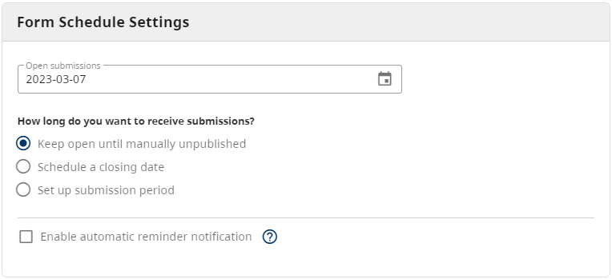
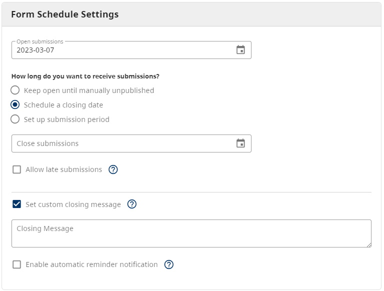

[Home](index) > [CHEFS Capabilities](CHEFS-Capabilities) > [CHEFS functionalities](CHEFS-functionalities) > **Schedule and Reminder notification**
***

- [Form schedule](#Form-schedule)
- [Reminder notifications](#Reminder-notifications)

## Form schedule 

This feature allows the form designer to schedule form submissions. By enabling this feature form designer can Limit the submissions to a form by selecting Open and Close submission dates or a specific period. The schedule feature can be enabled by clicking on the "Form Submission Schedule" checkbox under the Form schedule settings on form settings. 

One thing to remember is that this feature can only be available to the forms that have at least one version published. Three scenarios can schedule a form submission.

By enabling this radio box **"Keep open until manually unpublished**" the form submission will normally work, the only limit a form designer can use is to select an "Open submissions date," so basically form will be open on a specific date and will be available until the form get unpublished manually.

**"Schedule a closing date"** is another option where the form designer can select a specific closing date for a form submission. Selecting the Open and Close date form will open submissions for a specific selected period only. Plus, the form designer can allow end users to submit the form with a Grace period. To do so, the Form designer can use the "Allow late submissions" option and choose a specific interval.
Upon closing a form, the Form designer can set a custom message for the end user as well. That can be seen on the front end once the form gets closed for a specific period. This feature can be used by clicking on the "Set custom closing message" checkbox.

Last option"**Set up submission period**" will act similarly to the previous one but setting up this option is a bit different. Here Form designer has to choose a period and interval to close the form submission. The first input accepts a Positive integer/number and the next one accepts a period that could be Days, Weeks, Months, etc. So form will be open from the Open submission date to the Period selected by the form designer. Again form designers can allow end users to give a grace period for submission by enabling allow late submission option.
One advanced feature here is to set up a Repeat period, Where a Form Designer can set up a form availability repeatedly. By means, the form designer can select a particular repetition to occur for the current form by inputting a positive number in the very first input box that says "Every" as a placeholder, then using the second drop box to select a period, and the last thing using an End date when the repetition should end.
Upon closing a form, the Form designer can set a custom message for the end user as well. That can be seen on the frontend once the form gets close for a specific period. This feature can be used by clicking on the "Set custom closing message" checkbox.

## Reminder Notifications
**[Back to top](#top)**

Reminder notifications is a service of chefs that allows the system to send reminder emails to the submitter of a specific form during the open submission period. Generally, it sends three emails, one on the first day of opening, the second in the middle, and the last one day before the end of the period.

We have three types of form schedules that trigger reminder emails:

1. form without an End Date
1. form with a Start and End Date
1. form with a Repeat Section

When the form has no end date, we send only one the first email, but if the date is after the current date.

When the form has a start and end date or a repeat period, we send three emails, but according to the length of the period. For example, if the date is less than three days, we send only one email the first. If it is between 4-6 days, we send two emails, the first and the last. If the period is more than six days, we send three emails, one at the start, one in the middle and the day before the end of the period. 

**What is a period?**

It is a moment when a form is open for submission, containing a start date and an end date. There are two types of periods. A simple one includes only a start and end date. The second one also has a start and end date but repeats according to an interval. 

**[Back to top](#top)**