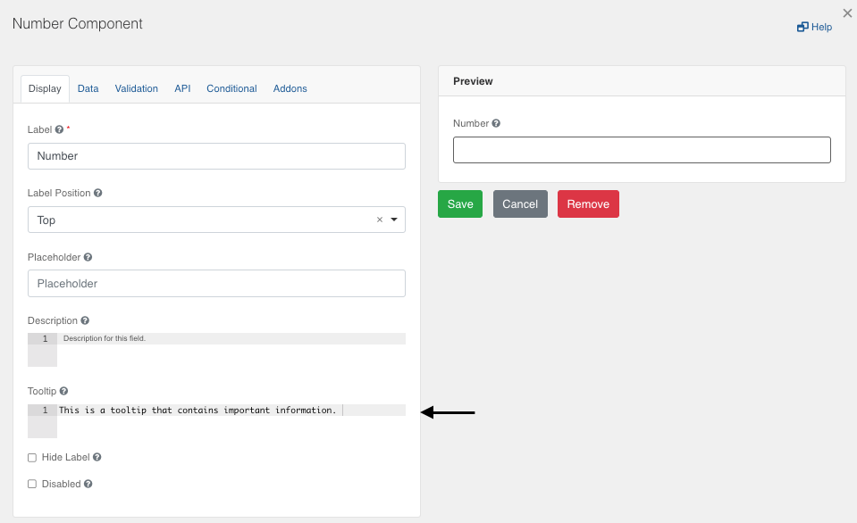
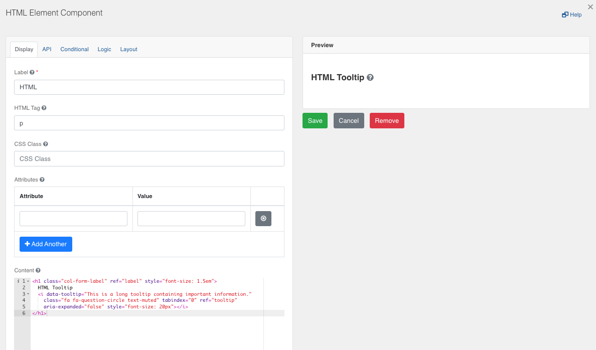

[Home](index) > [CHEFS Components](CHEFS-Components) > [Custom Components](Custom-components) > **Tooltip**
***

##  Examples
> Try a working example<br>
> [View example](https://submit.digital.gov.bc.ca/app/form/submit?f=3897ab9e-b9f2-43d5-ab95-3d1344c1516e)

<!-- > Download this example file and [import](Importing-and-exporting-form-designs) it into your design<br>
> [example_tooltip_for_text_images_component_schema.json](examples/example_tooltip_for_text_images_component_schema.json) -->
***

## Tooltip (Tutorial)

By default, most of the form.io components such as the ‘Number’ and ‘Text’ fields have a tooltip capability which displays information when a user hovers their cursor over it. 


To add a tooltip to a component, simply click on Settings (gear icon), and add the tooltip text in the ‘Tooltip’ field under the ‘Display’ tab.




However, some fields such as the ‘Text/Images Component' do not have this capability. This limits CHEFS’ ability to display tooltips next to standalone text such as a heading. This limitation can be overcome by using an ‘HTML Component' and adding form.io’s own tooltip HTML class.


To achieve this, add an ‘HTML Element Component’ to your form and click on the Settings (gear) icon. Enter the following HTML code into the ‘Content’ field, replacing ‘HTML Tooltip’ with your custom text. 



```
<h1 class="col-form-label" ref="label" style="font-size: 1.5em">
  HTML Tooltip
  <i data-tooltip="This is a long tooltip containing important information." 
    class="fa fa-question-circle text-muted" tabindex="0" ref="tooltip" 
    aria-expanded="false" style="font-size: 20px"></i>
</h1>
```

<!-- **[Back to top](#top)** -->

***
[Terms of Use](Terms-of-Use) | [Privacy](Privacy) | [Security](Security) | [Service Agreement](Service-Agreement) | [Accessibility](Accessibility)